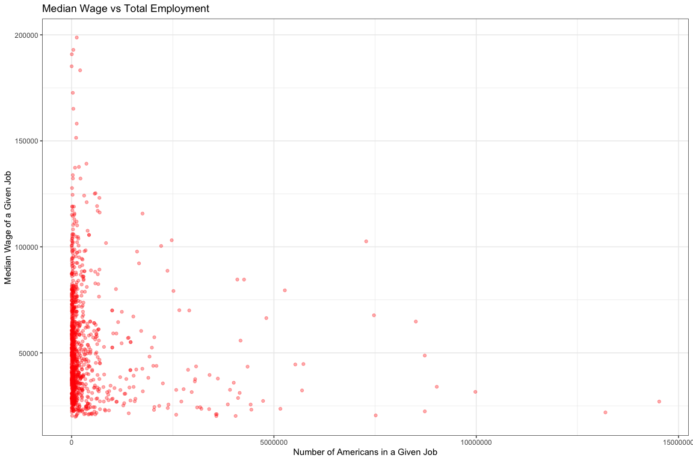
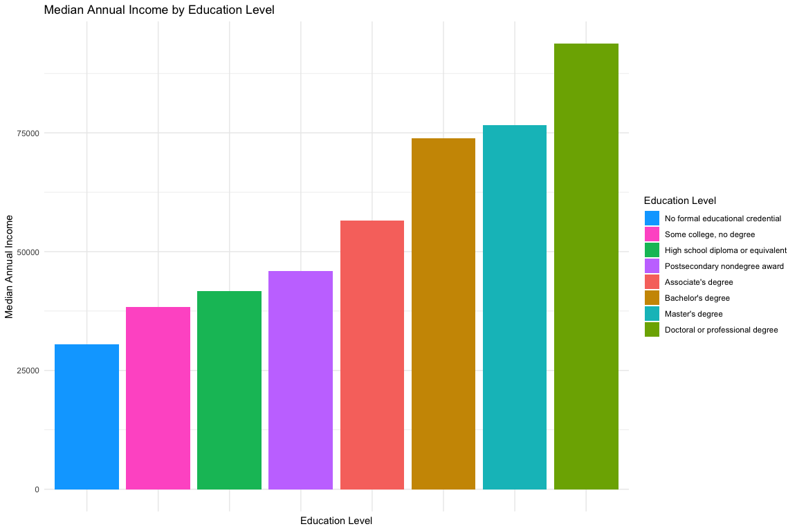
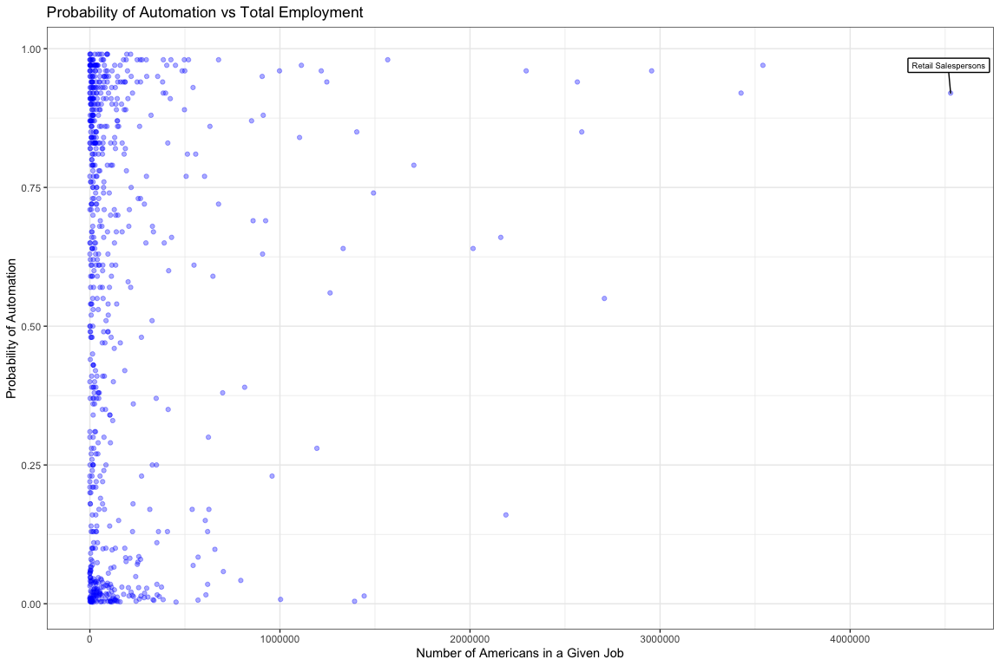
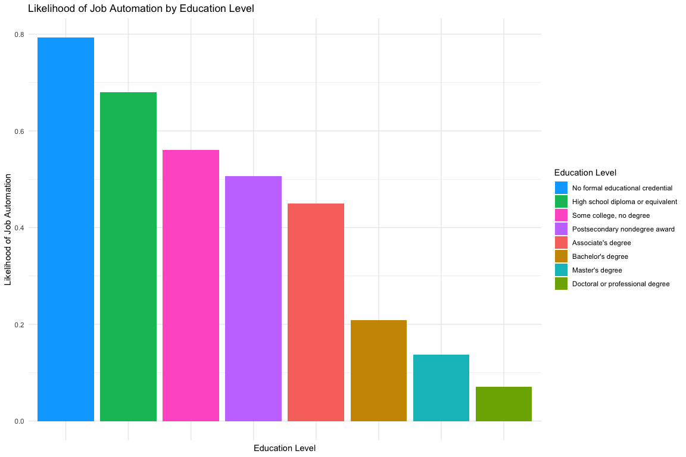
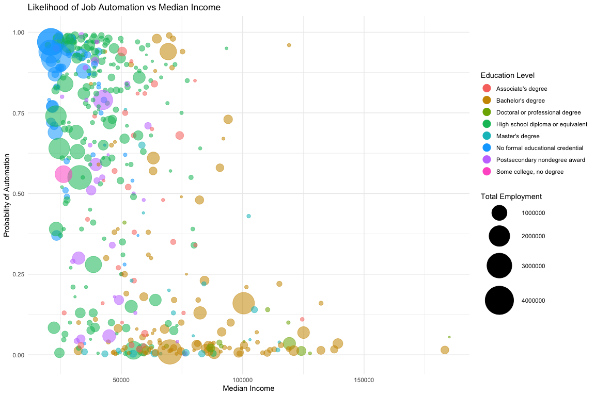
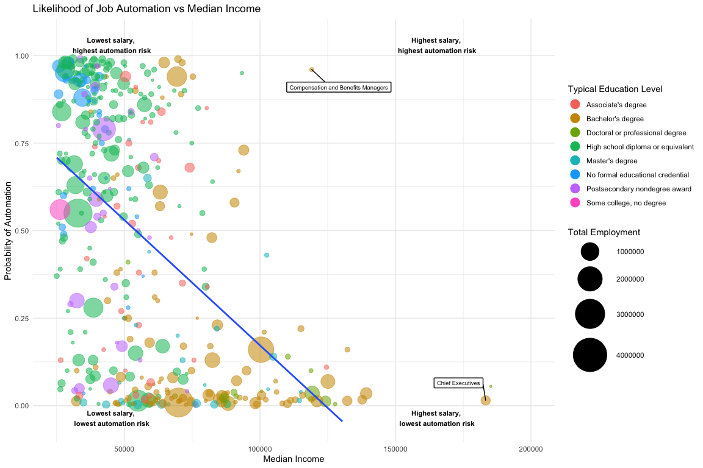

### Goal

The goal of this project is to understand the relationship between income, education, and automation. It asks the following: **Is a given job's income correlated to its likelihood of automation? Are jobs which are predominantly less educated more or less likely to be automated? How many workers are in the industries that will be automated?**

``` r
rm(list=ls())
library(ggplot2)
library(ggthemes)
library(dplyr)
library(ggrepel)
library(tools)
library(readxl)
library(tidyverse)
library(knitr)
options(scipen=999)
theme_set(theme_minimal())
```

### Load datasets:

There are three datasets for this project. 1) Educational attainment broke down by occupation, provided by BLS [here](https://www.bls.gov/emp/ep_education_training_system.htm) 2) Salaries, median hourly/annual wages broke down by occupation, provided by BLS [here](https://www.bls.gov/oes/current/oes_nat.htm#11-0000) 3) Risk of automation broken down by occupation, provided by Carl Benedikt Frey and Michael A. Osborne (but compiled [here](https://data.world/wnedds/occupations-by-state-and-likelihood-of-automation))

``` r
setwd("/Users/connorrothschild/Desktop/R/Automation Project")
education <- read_excel("education.xlsx", skip=1)
salary <- read_excel("national_M2017_dl.xlsx")
automation <- read_excel("raw_state_automation_data.xlsx")
```

Analysis
--------

I'll begin by finding which occupations contribute most to the American economy (in USD).

``` r
salary1 <- salary %>% 
  group_by(OCC_TITLE) %>% 
  mutate(natlwage = TOT_EMP * as.numeric(A_MEAN)) %>%
  filter(!is.na(TOT_EMP)) %>%
  filter(!is.na(A_MEAN)) %>%
  filter(!is.na(A_MEDIAN))
  
salary1$A_MEDIAN = as.numeric(as.character(salary1$A_MEDIAN))
salary2 <- select(salary1, OCC_TITLE, TOT_EMP, A_MEDIAN, natlwage) %>% 
  distinct()

options(scipen=999)
salary2 %>%
  arrange(desc(natlwage)) %>% 
  head() %>% kable()
```

| OCC\_TITLE                                         |   TOT\_EMP|  A\_MEDIAN|       natlwage|
|:---------------------------------------------------|----------:|----------:|--------------:|
| All Occupations                                    |  142549250|      37690|  7215843035000|
| Management Occupations                             |    7280330|     102590|   872984370300|
| Office and Administrative Support Occupations      |   21965480|      34740|   833589966000|
| Healthcare Practitioners and Technical Occupations |    8506740|      64770|   687004322400|
| Sales and Related Occupations                      |   14522580|      27020|   590778554400|
| Business and Financial Operations Occupations      |    7472750|      67710|   570395007500|

Management occupations contribute the most, followed by office and administrative support, healthcare practictioners and technical occupations.

This is a quick vizualization which represents the relationship between a job's median wage and the number of Americans which have that job.

``` r
salary2 %>% filter(TOT_EMP < 15000000) %>%
  ggplot(mapping=aes(x=TOT_EMP, y=A_MEDIAN)) +
  geom_point(alpha=1/3, col="red") +
  theme_bw() +
  ggtitle("Median Wage vs Total Employment") +
  xlab("Number of Americans in a Given Job") +
  ylab("Median Wage of a Given Job") 
```



We now have three data points:

1.  The name of an occupation

2.  The annual median wage of that occupation

3.  The amount it contributes to the American economy (or, more specifically, the amount workers are paid as an entire occupation for their work, annually)

Next, I want to cross-reference the salary data with the education data.

``` r
library(plyr)
education1 <- education %>% select(-...2)
  
education1 <- rename(education1, c("2016 National Employment Matrix title and code" = "occupation",
                     "Less than high school diploma" = "lessthanhs", 
                     "High school diploma or equivalent" = "hsdiploma",
                     "Some college, no degree" = "somecollege",
                     "Associate's degree" = "associates",
                     "Bachelor's degree" = "bachelors",
                     "Master's degree" = "masters",
                     "Doctoral or professional degree" = "professional"))

education2 <- education1 %>% 
  group_by(occupation) %>%
  mutate(hsorless = lessthanhs + hsdiploma,
         somecollegeorassociates = somecollege + associates,
         postgrad = masters + professional)

education2 <- education2 %>% drop_na()
```

Next, I want to join education2 and salary2 to start analysis of education's effect on salary.

``` r
salary2 <- rename(salary2, c("OCC_TITLE" = "occupation"))
salary2$occupation <- tolower(salary2$occupation)
education2$occupation <- tolower(education2$occupation)
edsal <- merge(as.data.frame(education2), as.data.frame(salary2), by="occupation") %>% drop_na()

head(edsal) %>% kable()
```

|     | occupation                                                                |  lessthanhs|  hsdiploma|  somecollege|  associates|  bachelors|  masters|  professional|  hsorless|  somecollegeorassociates|  postgrad|  TOT\_EMP|  A\_MEDIAN|     natlwage|
|-----|:--------------------------------------------------------------------------|-----------:|----------:|------------:|-----------:|----------:|--------:|-------------:|---------:|------------------------:|---------:|---------:|----------:|------------:|
| 1   | accountants and auditors                                                  |         0.0|        4.0|          7.6|         9.2|       55.6|     20.8|           2.8|       4.0|                     16.8|      23.6|   1241000|      69350|  96698720000|
| 3   | actuaries                                                                 |         0.0|        0.0|          1.2|         1.5|       62.1|     24.9|          10.3|       0.0|                      2.7|      35.2|     19210|     101560|   2206268500|
| 4   | adhesive bonding machine operators and tenders                            |        21.6|       49.2|         21.5|         2.2|        4.9|      0.5|           0.0|      70.8|                     23.7|       0.5|     15860|      32710|    549231800|
| 5   | administrative law judges, adjudicators, and hearing officers             |         0.2|        0.4|          0.6|         0.5|        5.0|      4.4|          88.9|       0.6|                      1.1|      93.3|     14480|      94790|   1423094400|
| 6   | administrative services managers                                          |         2.1|       17.9|         26.1|        12.1|       29.7|     10.3|           1.7|      20.0|                     38.2|      12.0|    270100|      94020|  27922938000|
| 7   | adult basic and secondary education and literacy teachers and instructors |         1.8|       10.2|         18.4|         8.5|       35.9|     20.5|           4.7|      12.0|                     26.9|      25.2|     60670|      52100|   3446056000|

At this point I'm realizing that having the educational breakdown (\# of Bachelor's degrees, PhD's, etc.) per job is interesting but may not be able to reveal a lot of key insights.

So, I'm going to introduce a fourth dataset: the *typical* education of a worker in a given occupation, also provided by BLS and found [here](https://www.bls.gov/emp/tables/education-and-training-by-occupation.htm).

``` r
typicaleducation <- read_excel("typicaleducation.xlsx")
typicaleducation2 <- typicaleducation %>% select(occupation,typicaled,workexp)
typicaleducation2 <- typicaleducation2 %>% drop_na()
typicaleducation2$occupation <- tolower(typicaleducation2$occupation)
edsal2 <- merge(as.data.frame(edsal), as.data.frame(typicaleducation2), by="occupation")

head(edsal2) %>% kable()
```

| occupation                                                                |  lessthanhs|  hsdiploma|  somecollege|  associates|  bachelors|  masters|  professional|  hsorless|  somecollegeorassociates|  postgrad|  TOT\_EMP|  A\_MEDIAN|     natlwage| typicaled                         | workexp           |
|:--------------------------------------------------------------------------|-----------:|----------:|------------:|-----------:|----------:|--------:|-------------:|---------:|------------------------:|---------:|---------:|----------:|------------:|:----------------------------------|:------------------|
| accountants and auditors                                                  |         0.0|        4.0|          7.6|         9.2|       55.6|     20.8|           2.8|       4.0|                     16.8|      23.6|   1241000|      69350|  96698720000| Bachelor's degree                 | None              |
| actuaries                                                                 |         0.0|        0.0|          1.2|         1.5|       62.1|     24.9|          10.3|       0.0|                      2.7|      35.2|     19210|     101560|   2206268500| Bachelor's degree                 | None              |
| adhesive bonding machine operators and tenders                            |        21.6|       49.2|         21.5|         2.2|        4.9|      0.5|           0.0|      70.8|                     23.7|       0.5|     15860|      32710|    549231800| High school diploma or equivalent | None              |
| administrative law judges, adjudicators, and hearing officers             |         0.2|        0.4|          0.6|         0.5|        5.0|      4.4|          88.9|       0.6|                      1.1|      93.3|     14480|      94790|   1423094400| Doctoral or professional degree   | 5 years or more   |
| administrative services managers                                          |         2.1|       17.9|         26.1|        12.1|       29.7|     10.3|           1.7|      20.0|                     38.2|      12.0|    270100|      94020|  27922938000| Bachelor's degree                 | Less than 5 years |
| adult basic and secondary education and literacy teachers and instructors |         1.8|       10.2|         18.4|         8.5|       35.9|     20.5|           4.7|      12.0|                     26.9|      25.2|     60670|      52100|   3446056000| Bachelor's degree                 | None              |

This data allows us to ask: **What is the median wage for each typical level of education?**

``` r
detach(package:plyr)
edsal3 <- edsal2 %>% 
  group_by(typicaled) %>% 
  summarise(medianwage = mean(A_MEDIAN))

legend_ord <- levels(with(edsal3, reorder(typicaled, medianwage)))

ggplot(data=edsal3, aes(x = reorder(typicaled, medianwage), y = medianwage)) +
  geom_col(aes(fill=typicaled)) +
  ggtitle("Median Annual Income by Education Level") +
  xlab("Education Level")+
  ylab("Median Annual Income") +
  labs(fill="Education Level") +
  scale_fill_discrete(breaks=legend_ord) +
  theme_minimal() +
  theme(axis.text.x=element_blank())
```



The results are unsurpising: more educated people on average earn more.

Lastly, I bring in the automation data.

``` r
automationwstates <- automation %>% select(-soc)
automation1 <- automationwstates %>% select(occupation,probability,total)
head(automation) %>% kable()
```

| soc        | occupation                                |  probability|  alabama|  alaska|  arizona|  arkansas|  california|  colorado|  connecticut|  delaware|  district\_of\_columbia|  florida|  georgia|  hawaii|  idaho|  illinois|  indiana|   iowa|  kansas|  kentucky|  louisiana|  maine|  maryland|  massachusetts|  michigan|  minnesota|  mississippi|  missouri|  montana|  nebraska|  nevada|  new\_hampshire|  new\_jersey|  new\_mexico|  new\_york|  north\_carolina|  north\_dakota|   ohio|  oklahoma|  oregon|  pennsylvania|  rhode\_island|  south\_carolina|  south\_dakota|  tennessee|   texas|   utah|  vermont|  virginia|  washington|  west\_virginia|  wisconsin|  wyoming|    total|
|:-----------|:------------------------------------------|------------:|--------:|-------:|--------:|---------:|-----------:|---------:|------------:|---------:|-----------------------:|--------:|--------:|-------:|------:|---------:|--------:|------:|-------:|---------:|----------:|------:|---------:|--------------:|---------:|----------:|------------:|---------:|--------:|---------:|-------:|---------------:|------------:|------------:|----------:|----------------:|--------------:|------:|---------:|-------:|-------------:|--------------:|----------------:|--------------:|----------:|-------:|------:|--------:|---------:|-----------:|---------------:|----------:|--------:|--------:|
| 11-1011    | Chief Executives                          |        0.015|     1030|     760|     5750|      2710|       31150|       880|         1410|       340|                    2840|    14120|     6750|    1840|   1400|     17440|     4950|   2050|    4410|      3440|       1010|    920|      1800|          11020|      6260|       7490|          940|      5180|      600|       690|    1410|             940|          700|           70|      15410|             4310|            920|   5340|      6370|    2650|          9230|            390|             3400|            560|       5460|    5890|   3650|      280|      6320|        5910|             980|       3740|      160|   223270|
| 11-1021    | General and Operations Managers           |        0.160|    26930|    6490|    43300|     20680|      261780|     41540|        33280|      4080|                   26610|    77340|    90520|   11070|  12250|    121040|    49210|  25900|   19620|     26190|      29920|  12360|     47850|          71880|     58040|      41480|        24110|     41440|     4490|     14420|   17480|           11030|        44800|        15550|     162870|            53770|           7010|  64710|     27400|   32350|         70430|           6640|            31780|           3730|      44400|  168610|  36200|     2760|     52380|       43760|           10200|      32350|     4840|  2188870|
| 2011-11-01 | Advertising and Promotions Managers       |        0.039|       50|      40|      470|       110|        3760|       480|          300|         0|                     220|      750|      820|     200|    160|      3670|      290|    230|     230|       270|        320|    130|       460|           1290|       650|        610|          150|       390|       30|        80|     280|             150|          630|          190|       5130|              450|             70|    460|       200|       0|           570|            100|              270|              0|        670|    1210|    380|       40|       240|         640|              40|        200|        0|    28080|
| 2021-11-01 | Marketing Managers                        |        0.014|      530|     200|     4790|      1090|       33390|      3060|         4970|       590|                    1280|     7600|     7140|     540|    860|     14030|     2870|   1920|    1470|      1490|        920|    810|      2980|          11790|      3870|       7800|          470|      2590|      130|      1060|    1640|            1170|        11260|          350|      16500|             5650|            310|   5350|      1420|    4830|          6250|            550|             1710|             60|       3400|    9570|   2320|      380|      3840|        5830|             260|       2980|       30|   205900|
| 2022-11-01 | Sales Managers                            |        0.013|     2510|     400|    10650|      2650|       69180|      4570|         7040|       860|                    1180|    13560|    15460|    2470|   2200|     24150|     5770|   3350|    3250|      3420|       3560|    980|      5230|          14860|     10090|      12590|         1460|      5480|      190|      1930|    3350|            1750|        12840|         1200|      20170|             6750|            710|  11410|      3890|    6220|          8930|            850|             3540|            300|       8890|   22310|   3360|      480|      5360|        7390|             600|       5730|      180|   365250|
| 2031-11-01 | Public Relations and Fundraising Managers |        0.015|      400|     150|     1240|       300|        7010|       960|          980|       210|                    4360|     1710|     1470|     360|    200|      3830|      870|    960|     480|       630|        310|    420|      1350|           4200|      1300|       1880|          270|      1020|      140|       580|     470|             470|         1900|          180|       6040|             1100|            170|   1790|       720|    1470|          1640|            260|              520|              0|        870|    3680|    380|      210|      1250|        2100|             130|       1010|        0|    63950|

Next, I visualize the probability of automation vs total employment:

``` r
automation1 %>%
  ggplot(mapping=aes(x=total, y=probability)) +
  geom_point(alpha=1/3, col="blue") +
  theme_bw() +
  ggtitle("Probability of Automation vs Total Employment") +
  xlab("Number of Americans in a Given Job") +
  ylab("Probability of Automation") +
  geom_label_repel(data=subset(automation1, total > 4000000),
                   aes(total, probability,label=occupation), label.size=.5, label.r=.05, size=2.5, nudge_y = .05, nudge_x= -10000)
```



There doesn't seem to be a huge relationship between automation and number of employees, however there is some concentration at each of the poles.

Some final data cleaning, and the merge of the final dataset:

``` r
automation1$occupation <- str_replace_all(automation1$occupation, ";", ",")
automation1$occupation <- tolower(automation$occupation)
data <- merge(as.data.frame(edsal2), as.data.frame(automation1), by="occupation")
```

We can create an initial visualization of the relationship between automation risk and education level.

``` r
autovsedu <- data %>% 
  group_by(typicaled) %>% 
  summarise(medianwage = mean(A_MEDIAN),
            averageprobability = mean(probability))

legend_ord2 <- levels(with(autovsedu, reorder(typicaled, -averageprobability)))

ggplot(data=autovsedu, aes(x = reorder(typicaled, -averageprobability), y = averageprobability)) +
  geom_col(aes(fill=typicaled)) +
  ggtitle("Likelihood of Job Automation by Education Level") +
  xlab("Education Level")+
  ylab("Likelihood of Job Automation") +
  labs(fill="Education Level") +
  scale_fill_discrete(breaks=legend_ord2) +
  theme_minimal() +
  theme(axis.text.x=element_blank())
```



There is a rather clear correlation between level of education and automation risk: those who are more educated are better protected from automation.

We can then visualize this relationship by individual occupation:

``` r
ggplot(data=data) +
  geom_point(mapping=aes(x=A_MEDIAN, y=probability, size=TOT_EMP, alpha=1/10, col=typicaled))+
  scale_size(range = c(1, 20)) +
  ylim(-.01,1) +
  xlab("Median Income") +
  ylab("Probability of Automation") +
  ggtitle("Likelihood of Job Automation vs Median Income") +
  labs(size="Total Employment", col="Education Level") +
  labs(alpha=NULL) +
  guides(alpha=FALSE) +
  theme(legend.text = element_text(colour="black", size = 10)) +
  guides(col = guide_legend(override.aes = list(size=5))) +
  theme_minimal()
```



With labels, a final look:

``` r
data$occupation <- toTitleCase(data$occupation)

ggplot(data=data) +
  geom_point(mapping=aes(x=A_MEDIAN, y=probability, size=TOT_EMP, alpha=0.05, col=typicaled))+
  geom_smooth(aes(x=A_MEDIAN, y=probability), method="lm", se=FALSE) +
  scale_size(range = c(1, 20)) +
  ylim(-.05,1.05) +
  xlim(25000,200000) +
  xlab("Median Income") +
  ylab("Probability of Automation") +
  ggtitle("Likelihood of Job Automation vs Median Income") +
  labs(size="Total Employment", col="Typical Education Level") +
  labs(alpha=NULL) +
  guides(alpha=FALSE) +
  theme(legend.text = element_text(colour="black", size = 10)) +
  guides(col = guide_legend(override.aes = list(size=5))) +
  theme_minimal() +
  geom_label_repel(aes(A_MEDIAN,probability,label=occupation),subset(data, A_MEDIAN > 175000 & probability < .05), label.size=.5, label.r=.05, size=2.5, nudge_y = .05, nudge_x= -10000) +
  geom_label_repel(aes(A_MEDIAN,probability,label=occupation),subset(data, A_MEDIAN == 21030), label.size=.1, label.r=.01, size=1, nudge_y = 0,nudge_x=0) +
  geom_label_repel(aes(A_MEDIAN,probability,label=occupation),subset(data, A_MEDIAN == 24540), label.size=.1, label.r=.01, size=1, nudge_y = 0,nudge_x=0) +
  geom_label_repel(aes(A_MEDIAN,probability,label=occupation),subset(data, A_MEDIAN > 100000 & probability > .90), label.size=.5, label.r=.05, size=2.5, nudge_y = -.05,nudge_x=10000) +
  annotate("text", x = 165000, y = 1.03, label = "Highest salary,\n highest automation risk", size=3, fontface=2) +
  annotate("text", x = 165000, y = -0.035, label = "Highest salary,\n lowest automation risk", size=3, fontface=2) +
  annotate("text", x = 45000, y = -0.035, label = "Lowest salary,\n lowest automation risk", size=3, fontface=2) +
  annotate("text", x = 45000, y = 1.03, label = "Lowest salary,\n highest automation risk", size=3, fontface=2)
```



### Conclusions

Using the dataset I've used in this project, researchers Carl Frey and Michael Osborne [predicted](https://www.oxfordmartin.ox.ac.uk/downloads/academic/The_Future_of_Employment.pdf) that 47% of jobs are at risk of automation over the next couple decades.

The visuals above suggest that the ills of automation may not be evenly distributed across jobs.

Less educated workers are more likely to face job loss as a product of automation. Those with high school diplomas or less (green bubbles) find themself concentrated near the top of the y-axis, while those with Bachelor's degrees or higher on average face a lower risk of automation.

A job's salary is also predictive of automation probability. As the median income of a profession increases, the likelihood of automation displacing its workers decreases.

Automation's impact on work necessitates a policy response. The fact that automation will differentially impact different industries reminds us that this public policy will have to be strategic and thoughtful.
