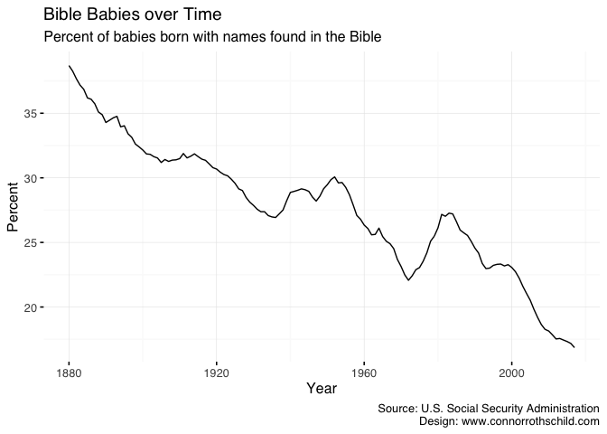
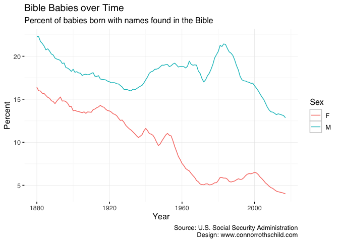
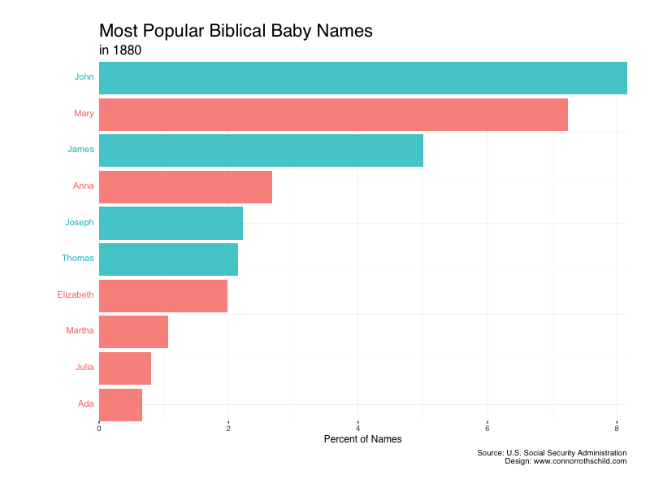

Bible Babies: Exploring Biblically-Inspired Baby Names over Time
================
Connor Rothschild
6/4/2019

Goal
----

The goal of this post is to explore how baby names have changed over time. More specifically, I'm focusing on the decision to name one's baby after a Biblical figure. I'm curious if the popularity of Biblically-inspired baby names has changed over time. We're able to explore this question using the [*babynames* package](https://cran.r-project.org/web/packages/babynames/babynames.pdf) in R, which contains historical data from the U.S. Social Security Administration ranging back to 1880. It contains information on the number of babies born with a certain name in a given year, the sex of those babies, the year they were born, and their name (obviously).

``` r
library(babynames)
library(knitr)
kable(head(babynames))
```

|  year| sex | name      |     n|       prop|
|-----:|:----|:----------|-----:|----------:|
|  1880| F   | Mary      |  7065|  0.0723836|
|  1880| F   | Anna      |  2604|  0.0266790|
|  1880| F   | Emma      |  2003|  0.0205215|
|  1880| F   | Elizabeth |  1939|  0.0198658|
|  1880| F   | Minnie    |  1746|  0.0178884|
|  1880| F   | Margaret  |  1578|  0.0161672|

In order to determine the popularity of "Bible babies," we need a list of names found in the Bible in order to search the *babynames* dataset. I pulled a random list of Bible baby names from [babycentre.co.uk](https://www.babycentre.co.uk/a1025984/baby-names-from-the-bible). The list likely doesn't include *all* names found in the Bible (only popular baby names), but that's probably no big deal considering few, if any, parents name their child Athaliah.

``` r
library(readxl)
library(tidyverse)
biblenames <- read_excel("biblebabynames.xlsx")

boybible <- biblenames %>% 
  select(boynames) %>% 
  rename(names = boynames)

girlbible <- biblenames %>% 
  filter(!is.na(girlnames)) %>% 
  select(girlnames) %>% 
  rename(names = girlnames)

biblenamesbind <- rbind(boybible, girlbible)

# use the %in% operator to match names with those in biblenamesbind
babynames <- babynames %>%
  mutate(biblepercent = ifelse(name %in% biblenamesbind$names, prop*100, 0)) 
```

Popularity of Biblical Baby Names over Time
-------------------------------------------

One initial question is whether the popularity of "Bible babies" has declined over time. Given that [Christian identity](https://www.prri.org/research/american-religious-landscape-christian-religiously-unaffiliated/) and [religiosity more generally](https://religionnews.com/2014/01/27/great-decline-religion-united-states-one-graph/) have experienced declines in recent years, one may assume that the decision to name one's baby after a Biblical figure has also become less popular.

``` r
babynames %>% 
  group_by(year) %>% 
  summarise(sum = sum(biblepercent)) %>% 
  ggplot(aes(x=year, y=sum)) +
    geom_line() +
  labs(title = "Bible Babies over Time",
       subtitle="Percent of babies born with names found in the Bible",
       x="Year",
       y="Percent",
       caption = "Source: U.S. Social Security Administration\n Design: www.connorrothschild.com")
```



Biblical names have become significantly less popular over time. We can split up the trend by sex to see if it is primarily driven by one group of babies.

``` r
babynames %>% 
  group_by(year, sex) %>% 
  summarise(sum = sum(biblepercent)) %>% 
  ungroup %>% 
  group_by(sex) %>% 
  ggplot(aes(x=year, y=sum, col=sex)) +
  geom_line() +
  labs(title = "Bible Babies over Time",
       subtitle="Percent of babies born with names found in the Bible",
       x="Year",
       y="Percent",
       color="Sex",
       caption = "Source: U.S. Social Security Administration\n Design: www.connorrothschild.com")
```



Indeed, much of the departure from Biblically-inspired baby names has been driven by girls. While 13% of boys born in 2017 shared a name with some biblical figure, the same was true of only 4% of girls.

Exploring Popular Names over Time Using gganimate
-------------------------------------------------

Finally, we can incorporate Thomas Lin Pedersen's [*gganimate* package](https://github.com/thomasp85/gganimate) to explore the popularity of *specific Bible names* over time. This was inspired by Kieran Healy's [similar visualization](https://kieranhealy.org/blog/archives/2019/05/13/baby-name-animation/) depicting changes in the structure of babies' names over time. The below code creates a GIF showing the shifting popularity of boys' names over time.

``` r
library(gganimate)
# make male rank variable
malebabynames <- babynames %>%
  filter(sex=="M") %>% 
  group_by(year) %>%
  mutate(rank = min_rank(-biblepercent) * 1) %>%
  filter(rank <= 10) %>%
  ungroup()

# plot male animation
maleanimation <- malebabynames %>% 
  filter(sex=="M") %>% 
  ggplot(aes(rank, group = name, 
                fill = as.factor(name), color = as.factor(name))) +
  geom_tile(aes(y = biblepercent/2,
                height = biblepercent,
                width = 0.9), alpha = 0.8, color = NA) +
  geom_text(aes(y = 0, label = paste(name, " ")), vjust = 0.2, hjust = 1) +
  coord_flip(clip = "off", expand = FALSE) +
  scale_y_continuous(labels = scales::comma) +
  scale_x_reverse() +
  guides(color = FALSE, fill = FALSE) +
  labs(title="Most Popular Biblical Baby Names for Males", 
       subtitle='in {closest_state}', x = element_blank(), y = "Percent of Names",
       caption = "Source: U.S. Social Security Administration\n Design: www.connorrothschild.com") +
  theme(plot.title = element_text(hjust = 0, size = 22),
        plot.subtitle = element_text(hjust = 0, size = 16),
        axis.ticks.y = element_blank(), 
        axis.text.y  = element_blank(), 
        plot.margin = margin(1,1,1,4, "cm")) +
  transition_states(year, transition_length = 4, state_length = 1) +
  ease_aes('cubic-in-out')

animate(maleanimation, fps = 25, duration = 25, width = 800, height = 600, renderer = gifski_renderer("boybiblebabies.gif"))
```


Replicating that code with minor tweaks creates the same animation for girls' names:

``` r
# make rank variable
femalebabynames <- babynames %>%
  filter(sex=="F") %>% 
  group_by(year) %>%
  mutate(rank = min_rank(-biblepercent) * 1) %>%
  filter(rank <= 10) %>%
  ungroup()

# plot animation
femaleanimation <- femalebabynames %>% 
  filter(sex=="F") %>% 
  ggplot(aes(rank, group = name, 
             fill = as.factor(name), color = as.factor(name))) +
  geom_tile(aes(y = biblepercent/2,
                height = biblepercent,
                width = 0.9), alpha = 0.8, color = NA) +
  geom_text(aes(y = 0, label = paste(name, " ")), vjust = 0.2, hjust = 1) +
  coord_flip(clip = "off", expand = FALSE) +
  scale_y_continuous(labels = scales::comma) +
  scale_x_reverse() +
  guides(color = FALSE, fill = FALSE) +
  labs(title="Most Popular Biblical Baby Names for Females", 
       subtitle='in {closest_state}', x = element_blank(), y = "Percent of Names",
       caption = "Source: U.S. Social Security Administration\n Design: www.connorrothschild.com") +
  theme(plot.title = element_text(hjust = 0, size = 22),
        plot.subtitle = element_text(hjust = 0, size = 16),
        axis.ticks.y = element_blank(),  
        axis.text.y  = element_blank(),  
        plot.margin = margin(1,1,1,4, "cm")) +
  transition_states(year, transition_length = 4, state_length = 1) +
  ease_aes('cubic-in-out')

animate(femaleanimation, fps = 25, duration = 25, width = 800, height = 600, renderer = gifski_renderer("girlbiblebabies.gif"))
```


Finally, we can combine some of the insights from our earlier plot (depicting the popularity of Biblical names by sex) to show which boys' names are responsible for their sex's relative dominance over girls' Biblically-inspired names.

``` r
# make rank variable
babynamesrank <- babynames %>%
  group_by(year) %>%
  mutate(rank = min_rank(-biblepercent) * 1) %>%
  filter(rank <= 10) %>%
  ungroup()

# plot animation
babyanimation <- babynamesrank %>% 
  ggplot(aes(rank, group = name, 
             fill = as.factor(sex), color = as.factor(sex))) +
  geom_tile(aes(y = biblepercent/2,
                height = biblepercent,
                width = 0.9), alpha = 0.8, color = NA) +
  geom_text(aes(y = 0, label = paste(name, " ")), vjust = 0.2, hjust = 1) +
  coord_flip(clip = "off", expand = FALSE) +
  scale_y_continuous(labels = scales::comma) +
  scale_x_reverse() +
  guides(color = FALSE, fill = FALSE) +
  labs(title="Most Popular Biblical Baby Names", 
       subtitle='in {closest_state}', x = element_blank(), y = "Percent of Names",
       caption = "Source: U.S. Social Security Administration\n Design: www.connorrothschild.com") +
  theme(plot.title = element_text(hjust = 0, size = 22),
        plot.subtitle = element_text(hjust = 0, size = 16),
        axis.ticks.y = element_blank(),  
        axis.text.y  = element_blank(),  
        plot.margin = margin(1,1,1,4, "cm")) +
  transition_states(year, transition_length = 4, state_length = 1) +
  ease_aes('cubic-in-out')

animate(babyanimation, fps = 25, duration = 25, width = 800, height = 600, renderer = gifski_renderer("combinedbiblebabies.gif"))
```


