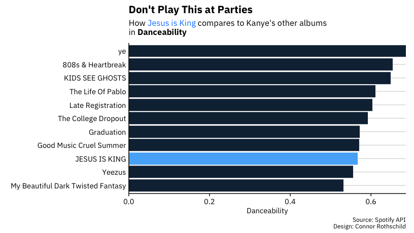
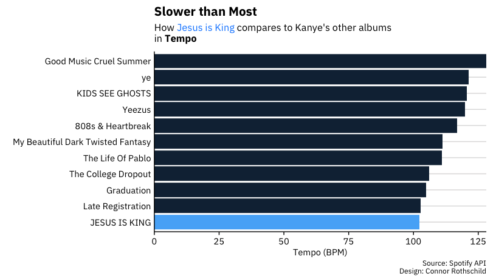
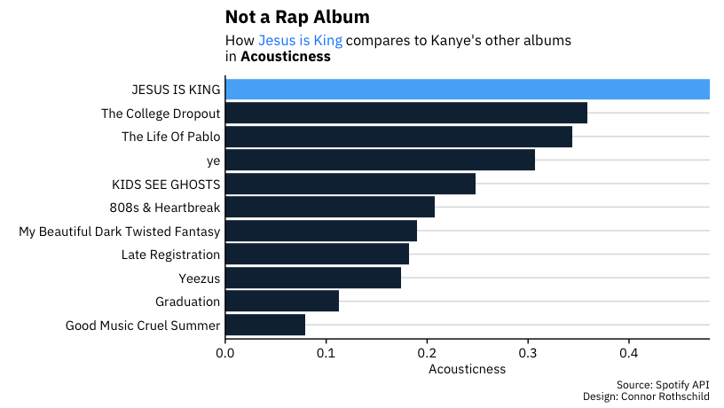

README
================
Connor Rothschild
11/9/2019

``` r
library(spotifyr)
library(tidyverse)
library(ggtext)
cr::set_cr_theme()
```

``` r
Sys.setenv(SPOTIFY_CLIENT_ID = 'x')
Sys.setenv(SPOTIFY_CLIENT_SECRET = 'x')

access_token <- get_spotify_access_token()

kanye <- get_artist_audio_features('kanye west')
kanye
```

Clean

``` r
grouped <- kanye %>% 
  group_by(album_name) %>% 
  summarise_at(vars(danceability:tempo), mean) 

grouped <- grouped %>% 
  filter(album_name != "Graduation (Alternative Business Partners)" & album_name != "Late Orchestration") %>% 
  mutate(album_name = ifelse(album_name == "Kanye West Presents Good Music Cruel Summer", "Good Music Cruel Summer", album_name))

##write.csv(grouped, "./kanye_data.csv")
```

Visualize

``` r
grouped %>% 
  mutate(album_name = fct_reorder(album_name, danceability),
         fill = ifelse(album_name == "JESUS IS KING", 1, 0)) %>% 
  ggplot(aes(x = album_name, y = danceability, fill = fill), show.legend = FALSE) +
  geom_col() +
  coord_flip() +
  cr::fix_bars() +
  theme(legend.position = "none") +
  labs(x = element_blank(),
       y = "Danceability",
       title = "Don't Play This at Parties", 
       subtitle = "How <span style='color:#1089ff'>Jesus is King</span> compares to Kanye's other albums<br>in **Danceability**",
       caption = "Source: Spotify API\nDesign: Connor Rothschild") +
  theme(plot.subtitle = element_markdown(lineheight = 1.1))
```

<!-- -->

``` r
grouped %>% 
  mutate(album_name = fct_reorder(album_name, tempo),
         fill = ifelse(album_name == "JESUS IS KING", 1, 0)) %>% 
  ggplot(aes(x = album_name, y = tempo, fill = fill), show.legend = FALSE) +
  geom_col() +
  coord_flip() +
  cr::fix_bars() +
  theme(legend.position = "none") +
  labs(x = element_blank(),
       y = "Tempo (BPM)",
       title = "Slower than Most", 
       subtitle = "How <span style='color:#1089ff'>Jesus is King</span> compares to Kanye's other albums<br>in **Tempo**",
       caption = "Source: Spotify API\nDesign: Connor Rothschild") +
  theme(plot.subtitle = element_markdown(lineheight = 1.1))
```

<!-- -->

``` r
grouped %>% 
  mutate(album_name = fct_reorder(album_name, acousticness),
         fill = ifelse(album_name == "JESUS IS KING", 1, 0)) %>% 
  ggplot(aes(x = album_name, y = acousticness, fill = fill), show.legend = FALSE) +
  geom_col() +
  coord_flip() +
  cr::fix_bars() +
  theme(legend.position = "none") +
  labs(x = element_blank(),
       y = "Acousticness",
       title = "Not a Rap Album", 
       subtitle = "How <span style='color:#1089ff'>Jesus is King</span> compares to Kanye's other albums <br>in **Acousticness**",
       caption = "Source: Spotify API\nDesign: Connor Rothschild") +
  theme(plot.subtitle = element_markdown(lineheight = 1.1))
```

<!-- -->

``` r
        # plot.title = element_text(hjust = -0.5))
```
