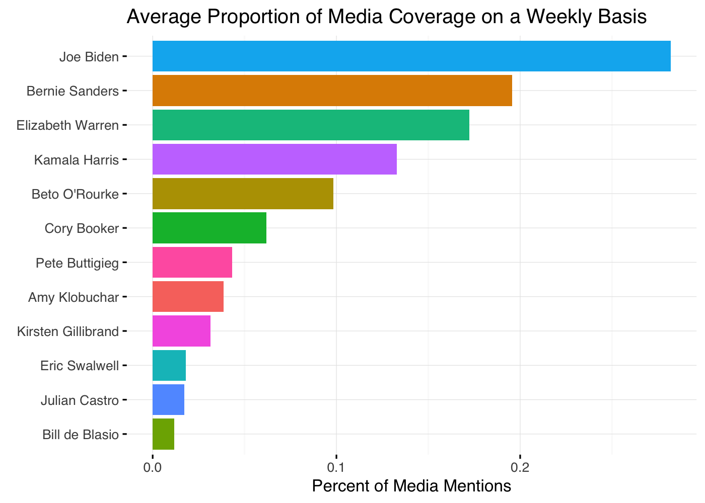
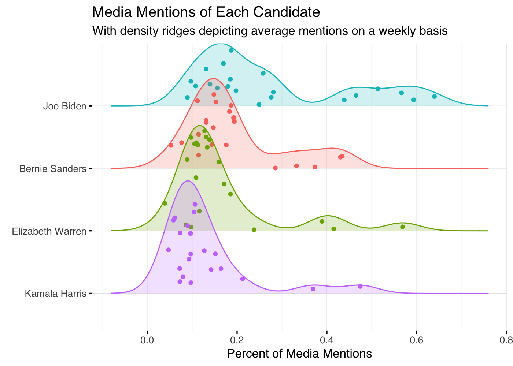
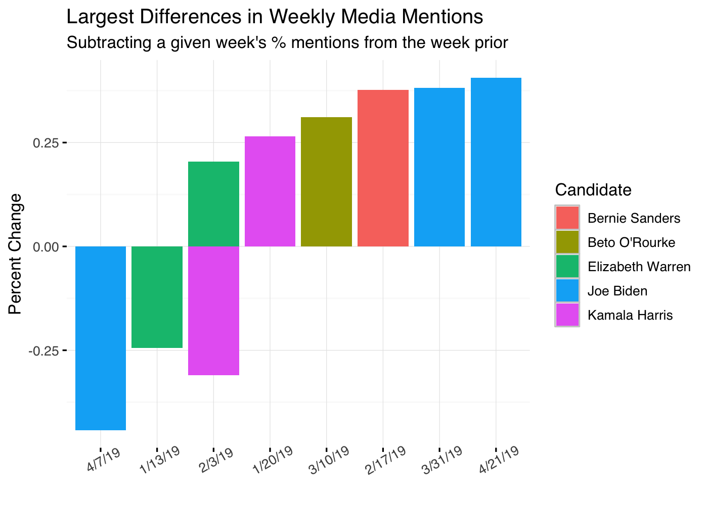

The Race for Media Attention
================
Connor Rothschild
5/30/2019

NOTE: This post has become somewhat outdated since it's [original publication](https://connorrothschild.github.io/media-mentions/) because the dataset (linked via FiveThirtyEight's GitHub) has changed variable names and some of the data has changed.

You can find a less technical version of this post without code [on my blog](https://www.connorrothschild.com/single-post/2019/05/30/The-Race-for-Media-Attention).

Overview
--------

In this post, I explore which presidential candidates are discussed most frequently in the American news media. I do so using the [GDELT Television API](https://blog.gdeltproject.org/gdelt-2-0-television-api-debuts/), which pulls data from the [TV News Archive](https://archive.org/details/tv). For sake of convenience, I use an existing dataset found on FiveThirtyEight's [GitHub](https://github.com/fivethirtyeight/data/tree/master/media-mentions-2020).

Load Libraries and Data
-----------------------

``` r
library(httr)
library(tidyverse)
library(dplyr)
library(ggplot2)
library(ggridges)
library(ggrepel)
library(viridis)
library(lubridate)
library(RColorBrewer)
library(devtools)
library(knitr)

<<<<<<< HEAD
data <- read.csv("https://raw.githubusercontent.com/connorrothschild/media-mentions/master/data.csv", header = T)
=======
data <- read.csv("data.csv")
>>>>>>> bb183fdf0bac1eb7af744f040bd0fa9fecbfe681
  #read.csv(("https://raw.githubusercontent.com/fivethirtyeight/data/master/media-mentions-2020/cable_weekly.csv"), header=T)
```

The dataset contains information on 22 presidential candidates, recording weekly the number of clips which mention a presidential candidate (*matched\_clips*) and dividing them by the total number of clips that week (*total\_clips*) to reveal the percent (*pct\_of\_all\_candidate\_clips*) of clips which mention that candidate.

| name         | date     |  pct\_of\_all\_candidate\_clips|  matched\_clips|  total\_clips|
|:-------------|:---------|-------------------------------:|---------------:|-------------:|
| John Delaney | 12/30/18 |                       0.0039432|               5|         76029|
| John Delaney | 1/6/19   |                       0.0019589|               2|         82964|
| John Delaney | 1/13/19  |                       0.0081566|               5|         82521|
| John Delaney | 1/20/19  |                       0.0020182|               2|         83649|
| John Delaney | 1/27/19  |                       0.0015723|               3|         80994|
| John Delaney | 2/3/19   |                       0.0006901|               1|         79183|

Of interest to us is the *name* of each candidate and the percent (*pct\_of\_all\_candidate\_clips*) of media mentions they receive on a weekly basis.

Analysis
--------

We can begin with a simple analysis of which candidates are discussed most frequently by the media by averaging their weekly proportion of mentions in the media.

``` r
data %>% 
  group_by(name) %>% 
  summarise(pct_of_all_candidate_clips = mean(pct_of_all_candidate_clips)) %>% 
  top_n(12, wt = pct_of_all_candidate_clips) %>% 
  ggplot(aes(x=reorder(name,pct_of_all_candidate_clips),y=pct_of_all_candidate_clips, fill=name)) +
  geom_col(show.legend=FALSE) +
  coord_flip() +
  labs(x=element_blank(),
       y="Percent of Media Mentions",
       title="Average Proportion of Media Coverage on a Weekly Basis") +
  theme_cr()
```



Somewhat unsurprisingly. Joe Biden and Bernie Sanders lead the pack in media attention. Joe Biden tends to receive significantly more media attention than the average candidate (a weekly average of 0.9% of overall media content compared to 0.14% for the average candidate).

How has that coverage changed over time?

``` r
data %>% 
  group_by(name) %>% 
  filter(mean(pct_of_all_candidate_clips) > .05) %>% # filter out unpopular candidates for plot clarity
  ggplot(aes(x=date,y=pct_of_all_candidate_clips,group=name, color=name)) +
  geom_point() +
  geom_line() +
  geom_label_repel(data=subset(data, pct_of_all_candidate_clips>.6),
          label = "Lucy Flores accuses Biden of \n inappropriate touching",
                   nudge_x = -50, nudge_y=-.05,
                   show.legend = FALSE,
                   color="black") + 
  geom_label_repel(data=subset(data, pct_of_all_candidate_clips > .58 & pct_of_all_candidate_clips <.6),
          label = "Joe Biden announces candidacy",
           nudge_x = -3, nudge_y=-.08,
           show.legend = FALSE,
           color="black") +
  theme_cr() +
  theme(axis.text.x = element_text(angle = 65)) +
  labs(x=element_blank(),
       y="Percent of Media Mentions",
       title="Media Mentions of Candidates Over Time") +
  scale_color_discrete(name="Candidate")
```


Evidently, much of Joe Biden's popularity in the media can be explained by a few large spikes in weekly media mentions. We can explore the distribution of weekly media mentions using a visualization known as a [density ridge plot](https://cran.r-project.org/web/packages/ggridges/vignettes/introduction.html).

``` r
data %>% 
  group_by(name) %>% 
  filter(mean(pct_of_all_candidate_clips) > 0.1) %>% 
  ungroup() %>% 
ggplot(aes(x = pct_of_all_candidate_clips, y = reorder(name,pct_of_all_candidate_clips), fill=name, color=name)) +
  geom_density_ridges(aes(point_colour=name), 
                      show.legend = FALSE, 
                      alpha = .2, 
                      point_alpha = 1, 
                      jittered_points = TRUE) +
  labs(x = "Percent of Media Mentions",
       y=element_blank(),
       title="Media Mentions of Each Candidate",
       subtitle="With density ridges depicting average mentions on a weekly basis") +
  theme_cr() 
```



This plot illustrates that most candidates enjoy the same levels of media coverage from one week to another. Joe Biden, however, often has weeks in which he receives much more attention than usual, as evidenced by his small peaks throughout the plot. Bernie Sanders, Kamala Harris, and Beto O'Rourke also experienced a few jumps in attention, likely when they announced their candidacy for the presidency.

This raises an interesting question: when did candidates experience the most drastic changes in media attention? For example, were there any weeks in which a candidate who normally enjoys nearly no media attention began to get a lot of it?

We can answer this question by calculating the difference between one week's coverage and the prior week's coverage (using the [lag](https://www.rdocumentation.org/packages/stats/versions/3.6.0/topics/lag) function).

``` r
data %>% 
  group_by(name) %>% 
  mutate(change = (pct_of_all_candidate_clips-(dplyr::lag(pct_of_all_candidate_clips, n=1, default=NA)))) %>% 
  filter(change >.2 | change < -.2) %>% 
  ggplot(aes(x=reorder(as.factor(date),change),y=change, fill=name)) +
  geom_col() +
  scale_fill_discrete(name="Candidate") +
  theme_cr() +
  theme(axis.text.x = element_text(angle = 30)) +
  labs(x=element_blank(),
       y="Percent Change",
       title="Largest Differences in Weekly Media Mentions",
       subtitle="Subtracting a given week's % mentions from the week prior")
```



Unsurprisingly, the bars tend to mirror one another. If a candidate enjoys a steep increase in media attention one week, they are likely to see a correlated drop in the following week (if that week were really a spike in attention). The plot suggests that Joe Biden's announcement (on April 25th) led to the most dramatic change in media attention in the 2020 cycle so far. Bernie Sanders also witnessed a spike in attention in the week following his announcement on February 19th. The same is true for the other candidates included in this plot.

Finally, I am interested in who is "winning" the race for media attention. Although a previous plot has shown media attention over time, this data can be somewhat hard to digest and interpret as so many candidates crowd the lower bound of the data (as they receive little media attention compared to Joe Biden).

By constructing a [bump chart](https://learnr.wordpress.com/2009/05/06/ggplot2-bump-chart/), I am able to depict the rank of each candidate in terms of their media attention in a given week. This type of visualization assigns each candidate a categorical rank and makes their progress throughout the campaign easier to visualize.

As an added benefit, this plot was difficult to construct and so it was rewarding to finally finish.

``` r
# create extended color palette for 22 candidates
nb.cols <- 22
mycolors <- colorRampPalette(brewer.pal(8, "RdYlBu"))(nb.cols)
show.top.n <- 10

# give each candidate a ranking for each week
data <- data %>% 
  group_by(date) %>% 
  arrange(date, desc(pct_of_all_candidate_clips), name) %>%  
  mutate(rank = row_number()) %>% 
  ungroup()

# filter most recent data so as to make the plot more digestible
recentdata <- data %>% 
  mutate(date = as.Date(date, "%m/%d/%y")) %>% 
  filter(date > "2019-03-01")

# for axis labels, create ranking at the start and end of the analysis
finranking <- recentdata %>% 
  filter(date=="2019-05-19") %>% 
  select(date,name,rank) 

startranking <- recentdata %>% 
  filter(date=="2019-03-03") %>% 
  select(date,name,rank) 

# and plot!
recentdata %>% 
  ggplot(aes(x=date, y=rank, group=name, label=name)) +
  geom_line(aes(color=name, alpha = 1), size = 2) +
  geom_point(aes(color = name, alpha = 1), size = 4) +
    geom_point(color = "#FFFFFF", size = 1) +
  scale_fill_manual(values = mycolors) +
  scale_y_reverse(breaks = 1:show.top.n) +
  scale_x_date(expand = c(0,29)) +
  coord_cartesian(ylim = c(1,show.top.n)) +
  geom_text(data = subset(startranking), size=3, 
            aes(x = date, hjust = 1.2)) +
  geom_text(data = subset(finranking), size=3, 
            aes(x = date, hjust = -.2)) +
  theme_cr() +
  theme(legend.position = "none") +
  labs(x = element_blank(),
       y = "Rank",
       title = "The Race for Media Attention",
       subtitle = "Candidates ranked by weekly media mentions")
```


Some takeaways:

1.  Bernie Sanders and Joe Biden consistently receive the most attention from the media.
2.  The most stark increase in media mentions can be seen in the rise of Pete Buttigieg, who began not even in the top 10 but now receives the third most media mentions of any candidate.
3.  Cory Booker and John Hickenlooper have all but disappeared from the media, while most other candidates remain in a place similar to where they began.

Next Steps
----------

Future work could capitalize upon this analysis by looking at the *content* of media coverage of candidates. In similar [work](https://www.connorrothschild.com/single-post/2019/05/21/following-the-race), I have performed preliminary sentiment analysis on the Tweets of presidential candidates. Other researchers have [shown](http://www.storybench.org/watching-the-watchdog-analyzing-initial-coverage-of-2020-candidates/) that media coverage of female presidential candidates tends to be more negative than coverage of male candidates. Continuing this work with a larger dataset could reveal interesting insights about the relationship between media, politics, and sexism.
