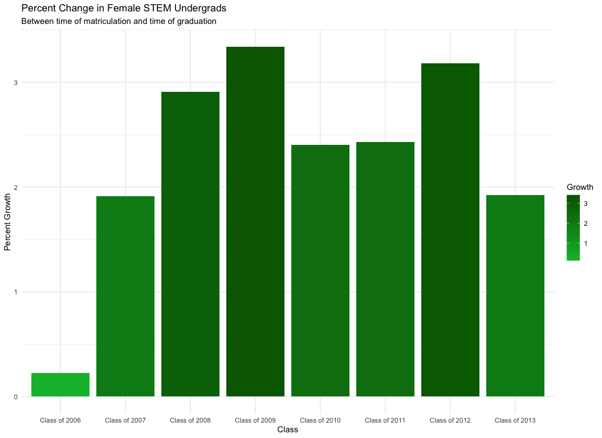

STEMigration: Leaving and Entering STEM Fields During College
================
Connor Rothschild
3/11/2019

The goal of this project is to explore trends in STEM enrollment for different populations. Specifically, it asks: **Are traditionally underrepresented groups more likely to migrate into or out of STEM majors? What discrepancies are present between different demographic groups?**

``` r
library(readxl)
library(tidyverse)
library(tidyr)
library(knitr)
```

### The Data

The dataset for this project comes from [data.world](https://data.world/womens-history-month/womens-history-month-week-2/workspace/file?agentid=nsf&datasetid=undergraduate-enrollment-in-engineering-programs&filename=tab2-9.xlsx) and contains the enrollment numbers for undergraduates nationwide.

``` r
undergradenrollment <- read_excel("undergradenrollment.xlsx")
```

I modified that data in Excel to make it more suitable for this project. The head of that data:

``` r
head(undergradenrollment) %>% kable()
```

| year          |  undergrads|  female|    male|   white|  asian|  black|  hispanic|  nativeamerican| pacificislander | multiracial |  foreignnational|  firstyearundergrads|  firstyearfemale|  firstyearmale|  firstyearwhite|  firstyearasian|  firstyearblack|  firstyearhispanic|  firstyearnativeamerican| firstyearpacificislander | firstyearmultiracial |  firstyearforeignnational|
|:--------------|-----------:|-------:|-------:|-------:|------:|------:|---------:|---------------:|:----------------|:------------|----------------:|--------------------:|----------------:|--------------:|---------------:|---------------:|---------------:|------------------:|------------------------:|:-------------------------|:---------------------|-------------------------:|
| Class of 2006 |      405489|   69869|  335620|  277921|  43902|  23414|     36389|            2598| NA              | NA          |            21265|               100228|            17047|          86787|           72471|           10421|            7619|               8403|                      642| NA                       | NA                   |                      4278|
| Class of 2007 |      431910|   74258|  357652|  295358|  47059|  24074|     39448|            2523| NA              | NA          |            23448|               110558|            16896|          86465|           72547|           10145|            7374|               8268|                      696| NA                       | NA                   |                      4331|
| Class of 2008 |      442952|   77671|  365281|  301483|  47738|  24771|     41919|            2629| NA              | NA          |            24412|               111006|            16238|          84173|           70732|            9281|            7212|               8338|                      623| NA                       | NA                   |                      4225|
| Class of 2009 |      468139|   83988|  384151|  315240|  50293|  25189|     47219|            2850| NA              | NA          |            27348|               114704|            16751|          83477|           69369|            9796|            7112|               8773|                      715| NA                       | NA                   |                      4463|
| Class of 2010 |      488435|   88063|  400372|  321558|  51057|  25996|     50051|            2665| 737             | 5961        |            30410|               119144|            18617|          91941|           76071|           11200|            7224|               9452|                      729| NA                       | NA                   |                      5882|
| Class of 2011 |      511306|   93633|  417673|  329348|  54403|  26989|     54245|            2554| 1093            | 8819        |            33855|               121766|            19342|          91664|           75508|           11106|            7338|              10282|                      765| NA                       | NA                   |                      6007|

The following command collapses the "**undergradenrollment**" file into a few summary statistics:

1.  The proportion of a class that is of a certain demographic (female, Black, Hispanic)
2.  The change in that proportion between that class's first year (matriculation) and their final year (graduation)

It then uses the gather function to make that data easier to analyze.

``` r
data <- undergradenrollment %>%
  mutate(propfemale = female/undergrads*100, firstyearpropfemale = firstyearfemale/firstyearundergrads*100) %>% 
  mutate(femalegrowth = propfemale-firstyearpropfemale) %>% 
  mutate(prophispanic = hispanic/undergrads*100, firstyearprophispanic = firstyearhispanic/firstyearundergrads*100) %>% 
  mutate(hispanicgrowth = prophispanic-firstyearprophispanic) %>% 
  mutate(propblack = black/undergrads*100, firstyearpropblack = firstyearblack/firstyearundergrads*100) %>% 
  mutate(blackgrowth = propblack-firstyearpropblack) %>% 
  select(year,femalegrowth,blackgrowth,hispanicgrowth,propfemale,prophispanic,propblack)  %>% 
  gather("type", "growth", 2:4) %>% 
  gather("proportiontype","proportion",2:4)
```

The structure of that new dataset:

``` r
head(data) %>% kable()
```

| year          | type         |     growth| proportiontype |  proportion|
|:--------------|:-------------|----------:|:---------------|-----------:|
| Class of 2006 | femalegrowth |  0.2225791| propfemale     |    17.23080|
| Class of 2007 | femalegrowth |  1.9104575| propfemale     |    17.19293|
| Class of 2008 | femalegrowth |  2.9068189| propfemale     |    17.53486|
| Class of 2009 | femalegrowth |  3.3371497| propfemale     |    17.94083|
| Class of 2010 | femalegrowth |  2.4039957| propfemale     |    18.02963|
| Class of 2011 | femalegrowth |  2.4279519| propfemale     |    18.31252|

``` r
summary(data) %>% kable()
```

|     |       year       |       type       |      growth     | proportiontype   |   proportion   |
|-----|:----------------:|:----------------:|:---------------:|:-----------------|:--------------:|
|     |     Length:72    |     Length:72    |  Min. :-1.8274  | Length:72        |  Min. : 5.014  |
|     | Class :character | Class :character | 1st Qu.:-0.7427 | Class :character | 1st Qu.: 5.588 |
|     |  Mode :character |  Mode :character | Median : 1.7827 | Mode :character  | Median :10.167 |
|     |        NA        |        NA        |  Mean : 1.0458  | NA               |  Mean :11.150  |
|     |        NA        |        NA        | 3rd Qu.: 2.3560 | NA               | 3rd Qu.:17.307 |
|     |        NA        |        NA        |  Max. : 3.3371  | NA               |  Max. :19.205  |

### Plots and Analysis

I am first curious how enrollment has changed for each group in my analysis. The following plots enrollment for different underrepresented groups as a proportion of overall enrollment in STEM majors at the undergraduate level.

``` r
ggplot(data=data, mapping = aes(x=year,y=proportion, colour=proportiontype, group=proportiontype)) +
  geom_point() +
  geom_line() +
  ggtitle("Demographic Proportion of Overall Enrollment in STEM Majors", subtitle="Over time") +
  xlab("Class") +
  ylab("Percent of Overall Class") +
  theme_minimal() +
  scale_color_discrete(name="Demographic",
                      breaks=c("propblack","propfemale","prophispanic"),
                      label=c("Black","Female","Hispanic"))
```


Of the traditionally underrepresented groups, women fare the best in STEM. But even at their peak, they only held 19% of seats in STEM classrooms.

Next, I am curious how these shifts vary from one graduation class to another. In other words, **which classes experience the greatest shifts in representation throughout their time in university?**

I explore this by mutating the data to include a new variable: *growth*. This variable (which may be more accurately be named "change") examines the difference between the underrepresented proportion of STEM enrollment at the **time of graduation** and the **time of matriculation**. If women were 19% of their class's STEM majors at time of matriculation in 2015 and 17% of their class's STEM majors at time of graduation, *growth* would be 2% (19%-17%).

We can explore these changes by graduation year:

``` r
data %>% distinct(year,type,.keep_all=TRUE) %>% 
ggplot(aes(fill=type, y=growth, x=year)) + 
  geom_bar(position="dodge", stat="identity") +
  xlab("Class") +
  ylab("Percent Change") +
  theme_minimal() +
  ggtitle("Percent Change in Proportion of Overall STEM Class", subtitle="Between time of matriculation and time of graduation") +
  scale_fill_discrete(name="Demographic",
                      label=c("Black","Female","Hispanic"))
```


It seems as if women experience the greatest growth in STEM enrollment during their time as undergraduates, while Black students tend to migrate *out* of STEM majors.

We can break that down group-by-group.

``` r
data %>% distinct(year,type,.keep_all=TRUE) %>% 
  filter(type=="blackgrowth") %>% 
  ggplot(mapping=aes(x=year,y=growth)) +
  geom_col(aes(fill=growth)) + 
  scale_fill_gradient(low = "darkred", high = "#F8766D") +
  ylab("Percent Attrition") +
  xlab("Class") +
  ggtitle("Percent Change in Black STEM Undergrads", subtitle = "Between time of matriculation and time of graduation") +
  labs(fill="Attrition") +
  theme_minimal()
```


``` r
data %>% distinct(year,type,.keep_all=TRUE) %>% 
  filter(type=="femalegrowth") %>% 
  ggplot(mapping=aes(x=year,y=growth)) +
  geom_col(aes(fill=growth)) +
  scale_fill_gradient(low = "#00BA38", high = "darkgreen") +
  ylab("Percent Growth") +
  xlab("Class") +
  ggtitle("Percent Change in Female STEM Undergrads", subtitle = "Between time of matriculation and time of graduation") +
  labs(fill="Growth") +
  theme_minimal()
```



``` r
data %>% distinct(year,type,.keep_all=TRUE) %>% 
  filter(type=="hispanicgrowth") %>% 
  ggplot(mapping=aes(x=year,y=growth)) +
  geom_col(aes(fill=growth)) +
  scale_fill_gradient(low = "#619CFF", high = "darkblue") +
  ylab("Percent Growth") +
  xlab("Class") +
  ggtitle("Percent Change in Hispanic STEM Undergrads", subtitle = "Between time of matriculation and time of graduation") +
  labs(fill="Growth") +
  theme_minimal()
```


Here are the previous graphs, faceted:

``` r
labels <- c(blackgrowth = "Black", femalegrowth = "Female", hispanicgrowth="Hispanic") 
data %>% distinct(year,type,.keep_all=TRUE) %>% 
  ggplot(mapping=aes(x=year,y=growth)) +
  geom_col(aes(fill=growth)) +
  ylab("Percent Change") +
  xlab("Class") +
  ggtitle("Percent Change in Proportion of STEM Undergrads", subtitle = "Between time of matriculation and time of graduation") +
  labs(fill="Percent\nChange") +
  theme_minimal() +
  facet_grid(. ~ type, labeller=labeller(type = labels)) +
  scale_x_discrete(labels = c("Class of 2006" = "2006", "Class of 2007" = "2007", "Class of 2008" = "2008", "Class of 2009" = "2009", "Class of 2010" = "2010", "Class of 2011" = "2011", "Class of 2012" = "2012", "Class of 2013" = "2013"))
```


### Summaries and Takeaways

The decision to migrate into or out of STEM majors is both an individual choice and one shaped by institutional factors. In the face of demographic discrepancies, universities may or may not make changes to make STEM fields more accessible to underrepresented groups.

The data paint a neutral picture of trends in STEM. This analysis may suggest something about individual choices; it may also suggest that universities are not doing enough to make STEM majors accessible to Black students. However, it is promising that women and Hispanic students are able to, and often choose to, migrate into STEM majors.

There does not seem to be a temporal dynamic to these decisions. Although some classes (the Class of 2009) were more than others likely to migrate into STEM majors, no trend makes itself apparent year-by-year.

This analysis may suggest that more can be done to bring women and racial minorities into STEM, or it may simply present the product of individual decisions on the part of underrepresented groups.
