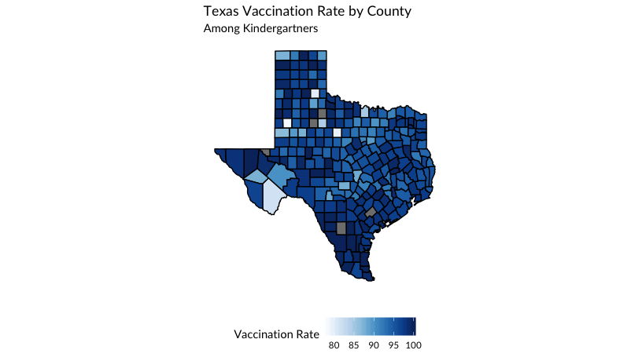

README
================
Connor Rothschild
7/24/2019

A brief exploration of Texas vaccination rates among kindergartners.
Also an attempt to use `rayshader` for the first time.

### Load Packages

``` r
library(readxl)
library(tidyverse)
library(stringr)
library(dplyr)
library(ggplot2)
library(ggmap)
library(maps)
library(mapdata)
library(scales)
library(tpltheme)
library(knitr)
```

### Read in Data

``` r
tx_vac <- read_excel("./Data/2018-2019 School Vaccination Coverage Levels - Kindergarten (XLS) .xlsx", skip = 2)

kable(head(tx_vac))
```

| Facility Number | School Type    | Facility Name                | Facility Address                          | County | DTP/DTaP/DT/Td | Hepatitis A | Hepatitis B |       MMR |     Polio | Varicella |
| --------------: | :------------- | :--------------------------- | :---------------------------------------- | :----- | -------------: | ----------: | ----------: | --------: | --------: | --------: |
|      9057816000 | Public ISD     | A W Brown Leadership Academy | 5701 RED BIRD CTR DR, DALLAS, TX, 75237   | Dallas |      0.8317308 |   0.9086538 |   0.9471154 | 0.8509615 | 0.8413462 | 0.8509615 |
|      9057829000 | Public ISD     | A+ Academy                   | 8225 BRUTON RD, DALLAS, TX, 75217         | Dallas |      1.0000000 |   1.0000000 |   1.0000000 | 0.9909091 | 1.0000000 | 1.0000000 |
|      9109901000 | Public ISD     | Abbott ISD                   | P O BOX 226, ABBOTT, TX, 76621            | Hill   |      1.0000000 |   1.0000000 |   1.0000000 | 1.0000000 | 1.0000000 | 1.0000000 |
|      7101130101 | Private School | Abercrombie Academy          | 17102 Theiss Mail Road, Spring, TX, 77379 | Harris |      1.0000000 |   1.0000000 |   1.0000000 | 0.7500000 | 1.0000000 | 0.7500000 |
|      9095901000 | Public ISD     | Abernathy ISD                | 505 7TH ST, ABERNATHY, TX, 79311          | Hale   |      1.0000000 |   1.0000000 |   1.0000000 | 1.0000000 | 1.0000000 | 1.0000000 |
|      7101220001 | Private School | Abiding Word Lutheran School | 17123 Red Oak Drive, Houston, TX, 77090   | Harris |      0.7692308 |   0.7692308 |   0.7692308 | 0.7692308 | 0.6923077 | 0.7692308 |

The data contains information on six different vaccines split up by
school. The set also contains information on the county of each school,
allowing us to aggregate on the county level. By finding the average of
the six vaccines listed in this dataset, we can see average vaccination
rate by county:

``` r
grouped <- tx_vac %>% 
  mutate(avgvac = (`DTP/DTaP/DT/Td`+`Hepatitis A`+`Hepatitis B`+MMR+Polio+Varicella)/6) %>%
  group_by(County) %>%
  summarize(avgvac = mean(avgvac, na.rm = TRUE)) %>%
  mutate(County = tolower(County)) %>%
  # rename to subregion so that we can later join with ggplot map data
  rename("subregion" = County) %>%
  filter(subregion != "king")

kable(head(grouped))
```

| subregion |    avgvac |
| :-------- | --------: |
| anderson  | 0.9676797 |
| andrews   | 0.9715335 |
| angelina  | 0.9693150 |
| aransas   | 0.9735294 |
| archer    | 0.9915167 |
| armstrong | 0.9677419 |

Next, we read in the county-level data from `ggplot2` and merge it with
our vaccination data:

``` r
counties <- map_data("county")
tx_county <- subset(counties, region == "texas")
merged <- left_join(tx_county, grouped, by = "subregion")
```

### Plot

Construct the plot using `geom_polygon()`, and pay special attention to
theme attributes (axes, panels, etc.).

Unfortunately, `theme_nothing()` led to some conflicts with `rayshader`,
so I essentially recreated it using `theme()` attributes.

``` r
tx <- ggplot(data = merged, mapping = aes(x = long, y = lat, group = group, fill = avgvac*100)) +
  coord_fixed(1.3) +
  geom_polygon(color = "black") +
  labs(fill = "Vaccination Rate") +
  #theme_nothing(legend = TRUE) +
  theme(legend.title = element_text(),
        #legend.key.width = unit(.1, "in"),
        panel.border = element_blank(), panel.grid.major = element_blank(),
        panel.grid.minor = element_blank(), axis.line = element_blank(), 
        axis.text.x = element_blank(), axis.text.y = element_blank(),
        axis.ticks = element_blank(),
        panel.background = element_rect(fill = "white"),
        text = element_text(family = "Lato"),
        legend.position = "bottom") +
   labs(x = element_blank(),
        y = element_blank(),
        title = "Texas Vaccination Rate by County",
        subtitle = "Among Kindergartners") + 
  tpltheme::scale_fill_continuous()
```

Here’s what the plot looks like before animation:

<!-- -->

### Rayshader

Load in `rayshader` and `rgl`. I’m not sure if `rgl` is necessary for
all R users, but I ran into a few errors on my system (Mac) prior to its
installation.

``` r
#devtools::install_github("tylermorganwall/rayshader")
library(rgl)
options(rgl.useNULL = FALSE)
library(rayshader)
```

Lastly, create the `plot_gg()` object by following the comprehensive
documentation on Wall’s
[README](https://github.com/tylermorganwall/rayshader).

``` r
par(mfrow = c(1,1))
rayshader::plot_gg(tx, width = 5, raytrace = TRUE, multicore = TRUE, height = 5, scale = 50)

# create custom rotation parameters here
phivechalf = 30 + 60 * 1/(1 + exp(seq(-7, 20, length.out = 180)/2))
phivecfull = c(phivechalf, rev(phivechalf))
thetavec = -90 + 60 * sin(seq(0,359,length.out = 360) * pi/180)
zoomvec = 0.45 + 0.2 * 1/(1 + exp(seq(-5, 20, length.out = 180)))
zoomvecfull = c(zoomvec, rev(zoomvec))

render_movie(filename = "./Outputs/tx_vac_vid", type = "custom", 
             frames = 360,  phi = phivecfull, zoom = zoomvecfull, theta = thetavec)
```

You can see the output [here](https://imgur.com/a/zFWGh1R).
